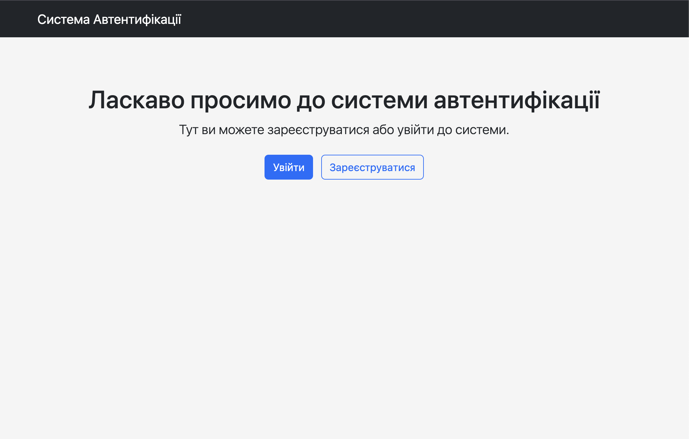

# Flask Authentication System

A lightweight user authentication and authorization web application built with Flask. This application provides secure, easy-to-implement user management for web projects.

## Features

- User registration with validation
- Secure authentication using Flask-Login
- Password hashing with Werkzeug
- Route protection with `@login_required`
- User session management
- Simple, responsive interface built with Bootstrap 5

## Technologies Used


 
 
 


## Preview




## Installation

1. Clone the repository:
```bash
git clone https://github.com/sophdi/flask_auth_app.git
cd flask_auth_app
```

2. Create a virtual environment:
```bash
python3 -m venv venv
source venv/bin/activate  # on Mac/Linux
venv\Scripts\activate   # On Windows
```

3. Install dependencies:
```bash
pip install -r requirements.txt
```

## Running the Application

1. Start the Flask development server:
```bash
flask run
```

2. Open your browser and navigate to:
```
http://127.0.0.1:5000
```

## Project Structure
```
flask-auth-system/
├── README.md
├── app.py
├── instance
│   └── users.db
├── requirements.txt
└── templates
    ├── base.html
    ├── dashboard.html
    ├── index.html
    ├── login.html
    └── signup.html  
```

## License

This project is intended for educational purposes only.